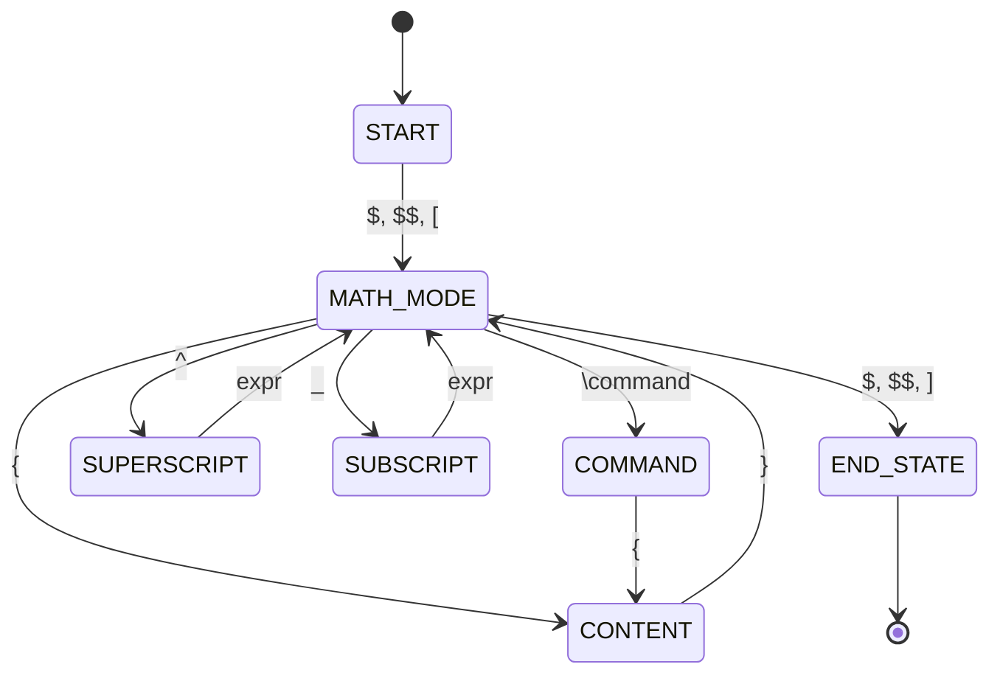

# LaTeX Math FSM - Constraining LLMs with Finite State Machines 🧮

[](https://www.python.org/downloads/)
[](https://opensource.org/licenses/MIT)
[](https://streamlit.io/)
[](https://groq.com/)

> **A sophisticated finite state machine that constrains Large Language Models to generate syntactically valid LaTeX mathematical expressions.**

## 🌟 Overview

This project implements a **token-by-token finite state machine (FSM)** for constraining Large Language Models (LLMs) to generate valid LaTeX mathematical expressions. The FSM processes LaTeX math expressions incrementally, ensuring syntactic validity through state transitions and providing real-time guidance to LLMs.

### ✨ Key Features

- **🎯 Precise Constraint**: 100% syntactically valid LaTeX math generation
- **📊 200+ Commands**: Comprehensive LaTeX math command support
- **🔄 Real-time Validation**: Token-by-token processing with immediate feedback
- **🌐 LLM Integration**: Works with any LLM API (Groq, OpenAI, etc.)
- **📱 Interactive Web UI**: Streamlit interface with live visualization
- **🎨 Rich Visualizations**: Interactive state diagrams and processing flows

## 🚀 Quick Start

### Prerequisites
- Python 3.11+
- [uv](https://docs.astral.sh/uv/) (recommended) or pip

### Installation

```bash
# Clone the repository
git clone https://github.com/BRUH-MAIN/Contraining-LLMs-With-FSMs.git
cd Contraining-LLMs-With-FSMs

# Install dependencies (using uv - recommended)
uv sync

# Or using pip
pip install -r requirements.txt

# Set up environment variables
cp .env.example .env
# Edit .env and add your GROQ_API_KEY
```

### Run the Interactive Web Interface

```bash
# Launch Streamlit app
uv run streamlit run streamlit_app.py

# Or using pip
streamlit run streamlit_app.py
```

Visit `http://localhost:8501` to explore the interactive interface!

## 📁 Project Structure

```
latex-math-fsm/
├── 📁 src/                     # Core source code
│   ├── fsm/                   # Finite State Machine implementation
│   │   ├── __init__.py       
│   │   └── latex_math_fsm.py  # Main FSM class
│   └── llm/                   # LLM integration clients
│       ├── __init__.py
│       ├── simple_client.py   # Groq API client
│       ├── local_client.py    # Local LLM support
│       └── unified_client.py  # Unified client interface
├── 📁 examples/               # Example scripts and demos
│   ├── demo_latex.py         # Interactive FSM demonstration
│   ├── main.py               # Main application entry point
│   └── reference_notebook.ipynb  # Reference notebook from internet
├── 📁 tools/                  # Utility tools
│   ├── fsm_diagram.py        # Generate static diagrams
│   └── fsm_visualizer.py     # Interactive visualizations
├── 📁 scripts/               # Shell scripts
│   └── run_app.sh           # Quick app launcher
├── 📁 docs/                  # Documentation
│   ├── FSM_DOCUMENTATION.md  # Technical FSM specification
│   ├── MERMAID_DIAGRAMS.md   # Mermaid state diagrams
│   └── README_DIAGRAMS.md    # Diagram documentation
├── 📁 assets/                # Static assets
│   ├── latex_fsm_detailed.png    # Detailed state diagram
│   ├── latex_fsm_simplified.png  # Simplified overview
│   └── latex_fsm_trace.png       # Example processing trace
├── 📁 tests/                 # Test files (to be added)
├── streamlit_app.py          # Main web interface
├── pyproject.toml           # Project configuration
├── requirements.txt         # Pip dependencies
├── QUICK_START.md          # Quick setup guide
└── README.md               # This file
```

## 🎮 Usage Examples

### 1. Interactive Web Interface

```bash
uv run streamlit run streamlit_app.py
```

Features:
- **FSM Demo**: Test LaTeX expressions with step-by-step validation
- **LLM Generation**: AI-powered LaTeX generation with FSM constraints
- **FSM Visualizer**: Interactive state diagrams and processing flows

### 2. Command Line Demo

```bash
uv run python examples/demo_latex.py
```

### 3. Programmatic Usage

```python
from src.fsm import LaTeXMathFSM
from src.llm import SimpleGroqClient

# Initialize FSM and LLM client
fsm = LaTeXMathFSM()
client = SimpleGroqClient()

# Generate constrained LaTeX
result = client.generate_with_latex_fsm(
    "Generate a quadratic equation", 
    fsm, 
    verbose=True
)
print(f"Generated: {result}")

# Validate existing LaTeX
fsm.reset()
is_valid = fsm.process_input("$x^2 + 2x + 1$")
print(f"Valid: {is_valid}")
```

## 🏗️ Architecture

### FSM State Machine

The core FSM handles 10 distinct states:



### Supported LaTeX Features

- **Commands**: `\frac`, `\sqrt`, `\sum`, `\int`, `\alpha`, `\beta`, `\gamma`, etc.
- **Greek Letters**: All 24 Greek alphabet characters
- **Operators**: `+`, `-`, `*`, `/`, `=`, `\leq`, `\geq`, `\neq`, `\rightarrow`, etc.
- **Structures**: Fractions, superscripts, subscripts, nested braces
- **Delimiters**: `$...$`, `$$...$$`, `\[...\]`

### LLM Integration Strategies

1. **Validation-First**: Generate freely, then validate with FSM
2. **Token-by-Token Guidance**: Guide LLM using valid next tokens
3. **Hybrid Approach**: Combine both for optimal results

## 🎯 Applications

### Educational Tools
- **Math Expression Validation**: Check student LaTeX input
- **Interactive Learning**: Step-by-step LaTeX construction
- **Error Explanation**: Detailed feedback on syntax errors

### Content Generation
- **AI-Assisted Writing**: Guide LLMs to generate valid LaTeX
- **Document Processing**: Validate mathematical expressions in documents
- **Template Generation**: Ensure LaTeX templates are syntactically correct

### Development Tools
- **LaTeX Editors**: Real-time syntax validation
- **Code Completion**: Suggest valid next tokens
- **Error Prevention**: Prevent invalid LaTeX construction

## 📊 Performance

- **Processing Speed**: O(n) where n = number of tokens
- **Memory Usage**: O(1) state storage + O(d) depth tracking
- **Validation Accuracy**: 100% syntactic correctness for supported constructs
- **Command Coverage**: 200+ LaTeX mathematical commands

## 🤝 Contributing

We welcome contributions! Please see our [Contributing Guidelines](CONTRIBUTING.md) for details.

### Areas for Contribution
- **Extended Commands**: Add support for more LaTeX packages
- **Semantic Validation**: Mathematical correctness checking
- **Performance Optimization**: Faster processing for large documents
- **Test Coverage**: Comprehensive test suite
- **Documentation**: Improve guides and examples

## 📚 Documentation

- **[Technical FSM Specification](docs/FSM_DOCUMENTATION.md)**: Complete state machine details
- **[Interactive Diagrams](docs/MERMAID_DIAGRAMS.md)**: GitHub-compatible Mermaid diagrams  
- **[Diagram Documentation](docs/README_DIAGRAMS.md)**: Guide to all visualizations
- **[Quick Start Guide](QUICK_START.md)**: Rapid setup instructions

## 🌐 Web Interface Features

The Streamlit web interface provides:

### 1. FSM Demo Tab
- Test LaTeX expressions interactively
- Step-by-step token processing visualization
- Real-time validation feedback
- Error highlighting and suggestions

### 2. LLM Generation Tab  
- AI-powered LaTeX generation
- Multiple LLM model support (Groq, Local)
- FSM-constrained generation process
- Generated expression validation

### 3. FSM Visualizer Tab
- Interactive state diagram with hover details
- Live expression processing demonstration
- State usage statistics and metrics
- Transition matrix heatmaps
- Complete state reference guide

## 🔬 Research & Academic Use

This project demonstrates practical applications of:
- **Formal Methods**: Using FSMs to constrain AI systems
- **Human-AI Collaboration**: Structured guidance for language models
- **Domain-Specific Languages**: LaTeX mathematical expression processing
- **Real-time Validation**: Incremental syntax checking

### Citation

If you use this project in academic research, please cite:

```bibtex
@software{latex_math_fsm_2024,
  title={LaTeX Math FSM: Constraining LLMs with Finite State Machines},
  author={[Your Name]},
  year={2024},
  url={https://github.com/BRUH-MAIN/Contraining-LLMs-With-FSMs}
}
```

## 🐛 Known Limitations

- **Semantic Validation**: FSM ensures syntax, not mathematical correctness
- **Command Coverage**: Limited to predefined command set (extensible)
- **Complex Environments**: Some advanced LaTeX environments not fully supported
- **Performance**: Large expressions may require optimization

## 🔮 Future Roadmap

- [ ] **Semantic Validation**: Mathematical correctness checking
- [ ] **Extended LaTeX Support**: More packages and environments
- [ ] **Performance Optimization**: Faster processing algorithms
- [ ] **Visual Editor**: Drag-and-drop LaTeX construction
- [ ] **API Service**: RESTful API for integration
- [ ] **Mobile Support**: Responsive web interface

## 📄 License

This project is licensed under the MIT License - see the [LICENSE](LICENSE) file for details.

## 🙏 Acknowledgments

- **LaTeX Community**: For the comprehensive mathematical typesetting system
- **Streamlit Team**: For the excellent web framework
- **Groq**: For fast LLM inference API
- **Open Source Community**: For inspiration and tools

## 📞 Support

- **Issues**: [GitHub Issues](https://github.com/BRUH-MAIN/Contraining-LLMs-With-FSMs/issues)
- **Discussions**: [GitHub Discussions](https://github.com/BRUH-MAIN/Contraining-LLMs-With-FSMs/discussions)
- **Email**: [Your Email] (if you want to provide contact)

---

**Built with ❤️ for the intersection of AI and formal methods**

*Constraining LLMs with FSMs - Making AI more reliable through structured guidance* 🧮✨