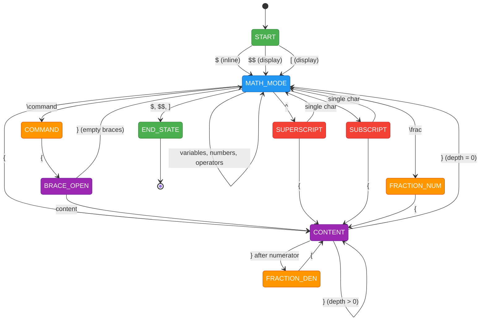
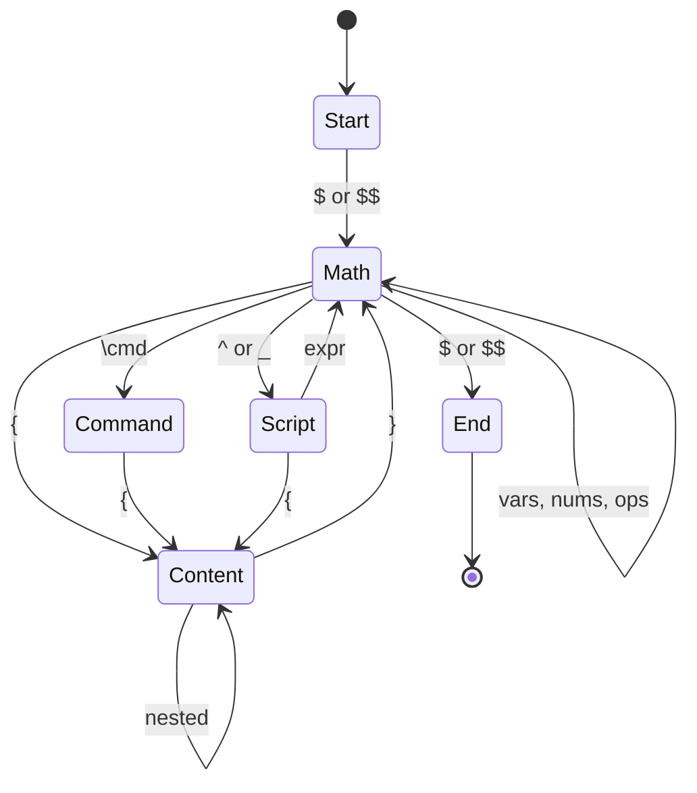
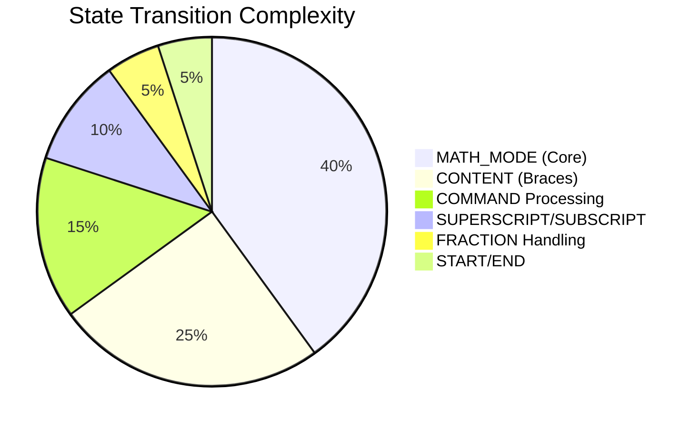

# LaTeX Math FSM - Mermaid State Diagrams

## Detailed State Machine Diagram



## Simplified Overview



## Example Processing Flow

```mermaid
flowchart TD
    Start(["`**START**
    Initial state`"])
    
    Token1["`**$**
    Math delimiter`"]
    
    State1(["`**MATH_MODE**
    Processing math`"])
    
    Token2["`**\frac**
    Fraction command`"]
    
    State2(["`**FRACTION_NUM**
    Expecting numerator`"])
    
    Token3["`**{**
    Opening brace`"])
    
    State3(["`**CONTENT**
    Reading numerator`"])
    
    Token4["`**x**
    Variable`"])
    
    Token5["`**}**
    Closing brace`"])
    
    State4(["`**FRACTION_DEN**
    Expecting denominator`"])
    
    Token6["`**{**
    Opening brace`"])
    
    State5(["`**CONTENT**
    Reading denominator`"])
    
    Token7["`**y**
    Variable`"])
    
    Token8["`**}**
    Closing brace`"])
    
    State6(["`**MATH_MODE**
    Back to math`"])
    
    Token9["`**$**
    End delimiter`"])
    
    End(["`**END_STATE**
    Valid expression`"])
    
    Start --> Token1
    Token1 --> State1
    State1 --> Token2
    Token2 --> State2
    State2 --> Token3
    Token3 --> State3
    State3 --> Token4
    Token4 --> State3
    State3 --> Token5
    Token5 --> State4
    State4 --> Token6
    Token6 --> State5
    State5 --> Token7
    Token7 --> State5
    State5 --> Token8
    Token8 --> State6
    State6 --> Token9
    Token9 --> End
    
    %% Styling
    classDef tokenBox fill:#E3F2FD,stroke:#1976D2,color:#000
    classDef stateBox fill:#F3E5F5,stroke:#7B1FA2,color:#000
    classDef endBox fill:#E8F5E8,stroke:#388E3C,color:#000
    
    class Token1,Token2,Token3,Token4,Token5,Token6,Token7,Token8,Token9 tokenBox
    class State1,State2,State3,State4,State5,State6 stateBox
    class Start,End endBox
```

## State Complexity Analysis



## Token Categories

```mermaid
mindmap
  root((LaTeX Tokens))
    Math Delimiters
      Inline: $
      Display: $$, \[, \]
    Commands
      Functions: \sin, \cos, \ln
      Greek: \alpha, \beta, \gamma
      Operators: \frac, \sqrt, \sum
      Relations: \leq, \geq, \neq
    Content
      Variables: a-z, A-Z
      Numbers: 0-9
      Operators: +, -, *, /
    Delimiters
      Braces: {, }
      Brackets: [, ]
      Parentheses: (, )
    Scripts
      Superscript: ^
      Subscript: _
```

## Usage Instructions

1. **View in GitHub**: These diagrams will render automatically in GitHub markdown
2. **Local Viewing**: Use Mermaid Live Editor at https://mermaid.live/
3. **VS Code**: Install Mermaid Preview extension
4. **Integration**: Copy diagrams into documentation, presentations, or papers

## Validation Examples

### ✅ Valid Expressions
- `$x^2$` - Simple superscript
- `$\frac{a+b}{c-d}$` - Fraction with operators  
- `$\sum_{i=1}^n \alpha_i x^i$` - Complex sum notation
- `$\int_0^\infty e^{-x} dx$` - Integral with limits

### ❌ Invalid Expressions  
- `$x^$` - Incomplete superscript
- `$\frac{a}{$` - Unmatched braces
- `$\unknown{x}$` - Unknown command
- `x^2` - Missing math delimiters